## Algorítmos de clustering

- Son técnicas que permiten encontrar subgrupos (clusters) en un conjunto de datos.

- Buscamos crear particiones que contengan elementos similares entre ellos pero distintos respecto a elementos de otra partición.

- Se trata de un problema no supervisado que tiene como objetivo encontrar la "estructura" de los datos.

## Algunas definiciones importantes

- $C_1, C_2,...,C_k$ es una partición de $C$ de tamaño $k$ si $\cup_i \ C_i = C$ y $C_i \cap C_j=\varnothing$ si $i\neq j$

- Una medida de disimiliaridad en un conjunto finito $X$, es una función $d:X\times X \rightarrow \mathbb{R}$, simétrica.

- Un clúster es un subconjunto $C_i$ donde $C_1, C_2,...,C_k$ es una partición de $C$

## Análisis de clústers

- Dan una descripción de los datos en términos de una fuerte similitud interna por lo que los clústers usualmente se definen en términos de cohesión interna e isolación externa.

- Diferentes clusterizaciones pueden ser comparadas respecto a:

  - Densidad

  - Varianza

  - Forma

  - Separación

## Algoritmos de optimización iterativa

1. Particion inicial de los datos

2. Para cada clúster se asigna un "centro"

3. Se recalculan los miembros de cada clúster usando los "centros"

4. Se actualizan los centros con la nueva asignación de miembros

5. Se repiten los pasos 2 a 4 hasta que no haya asignaciones nuevas  o no haya cambios en la calidad de los clústers.

## Ejemplo K-Means

```{r, echo=FALSE, message=FALSE}
require(ggplot2)
```

```{r}
n <- 200

b1 <- 25*cbind(rnorm(n,-1,.5),rnorm(n,-1,.5))
b2 <- 25*cbind(rnorm(n,-1,.5),rnorm(n, 1,.5))
b3 <- 25*cbind(rnorm(n, 1,.5),rnorm(n,-1,.5))
b4 <- 25*cbind(rnorm(n, 1,.5),rnorm(n, 1,.5))

b           <- as.data.frame(cbind(rbind(b1,b2,b3,b4),0))
colnames(b) <- c("x","y","cluster")
```

## Ejemplo K-Means

```{r, echo=FALSE}
ggplot(b, aes(x=x, y=y)) + geom_point(size=1) + geom_density2d(size=1.05) + theme_minimal()
```

## Ejemplo K-Means

```{r}
graficas <- list()

for( i in 1:12){ 
k <- kmeans(b,
            centers = i,          # tomar una particion aleatoria de tamaño i
            iter.max = 50,        # max num de iteraciones
            nstart = 1,           # if centers is a number, how many random sets should be chosen?
            algorithm = "Hartigan-Wong", #c("Hartigan-Wong", "Lloyd", "Forgy", MacQueen")
            trace = FALSE)

b$cluster     <- k$cluster # asignamos el cluster
graficas[[i]] <- ggplot(b, aes(x=x, y=y)) + 
  geom_point(aes(colour= as.factor(cluster))) + 
  ggtitle(paste("clusters = ",i,"\n Variación Interna = ", round(k$tot.withinss,1)))+
  theme_minimal()
}
```

## Ejemplo K-Means

```{r, fig.show='animate', echo=FALSE, dev='jpeg'}
for(i in 1:12){
  print(graficas[[i]])
}
```

## Ejercicio

- Usando [esta imagen](https://github.com/alberto-mateos-mo/seminario-est-fciencias/blob/master/RMarkdown/Clustering/ColorfulBird.jpg) aplique el algoritmo k-medias para comprimirla a través de una reducción del número de colores usados.

- La idea es clusterizar el espacio de colores y reemplazar cada pixel con el centro del clúster al que pertenece.

## Hint

```{r, eval=FALSE}
require(jpeg)
require(ggplot2)

img <- readJPEG("RMarkdown/Clustering/ColorfulBird.jpg")

dim(img)

img_df <- data.frame(
  x = rep(1:dim(img)[2], each = dim(img)[1]),
  y = rep(dim(img)[1]:1, dim(img)[2]),
  R = as.vector(img[,,1]),
  G = as.vector(img[,,2]),
  B = as.vector(img[,,3])
)

ggplot(data = img_df, aes(x = x, y = y)) + 
  geom_point(colour = rgb(img_df[c("R", "G", "B")])) +
  labs(title = "Original Image:") +
  theme_minimal()
```

## Imagen

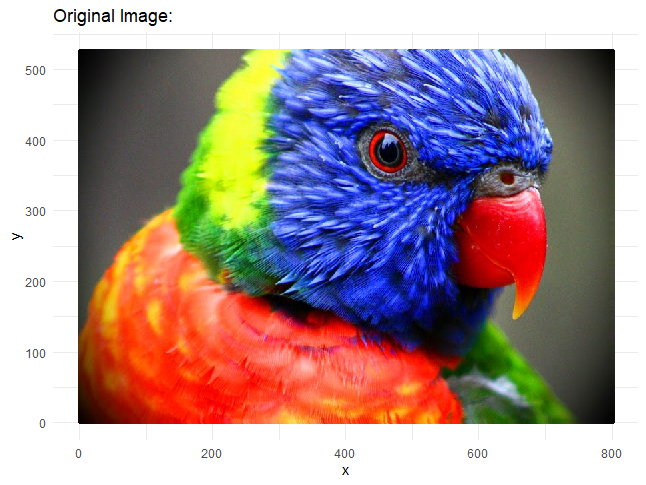

## El espacio de colores RGB


## Clustering k-means con 3 grupos

Clustering en el espacio RGB | Clustering en el espacio $PCA^2$
:----------------------------|----------------------------:
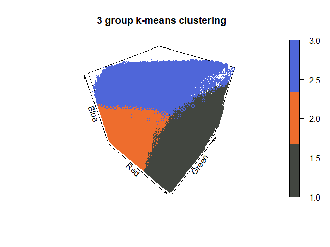 | 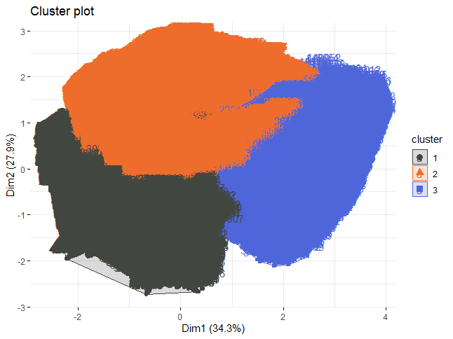

## Comparativo

Imagen en el espacio de colores original | Imagen en un espacio de 3 colores
:----------------------------------------|----------------------------------------:
 | 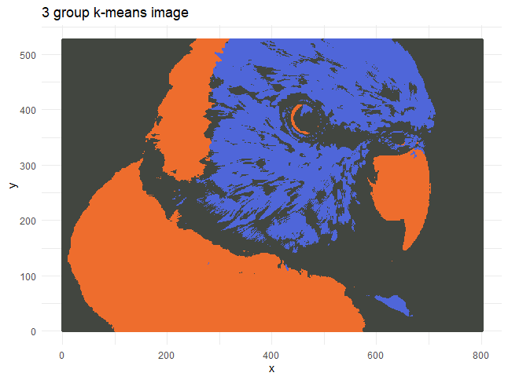

## Clustering k-means con 4 grupos

Clustering en el espacio RGB | Clustering en el espacio $PCA^2$
:----------------------------|----------------------------:
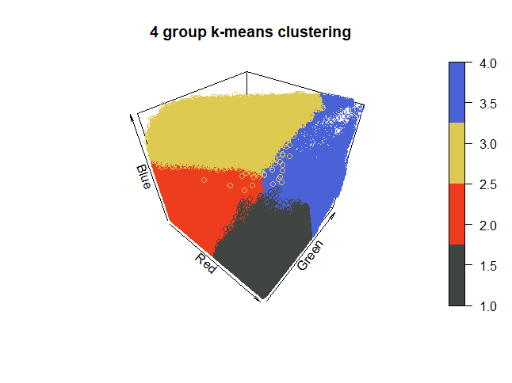 | 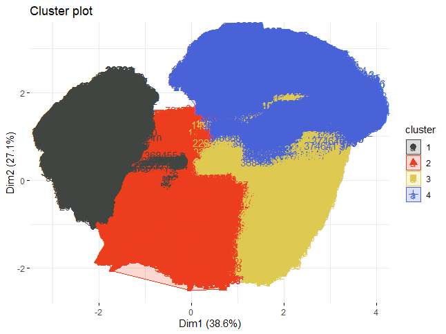

## Comparativo

Imagen en el espacio de colores original | Imagen en un espacio de 4 colores
:----------------------------------------|----------------------------------------:
 | 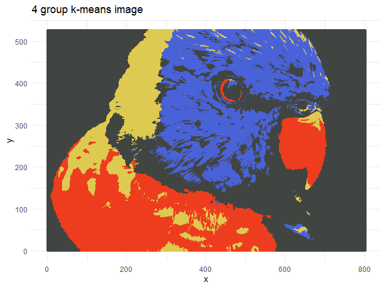

## Clustering k-means con 5 grupos

Clustering en el espacio RGB | Clustering en el espacio $PCA^2$
:----------------------------|----------------------------:
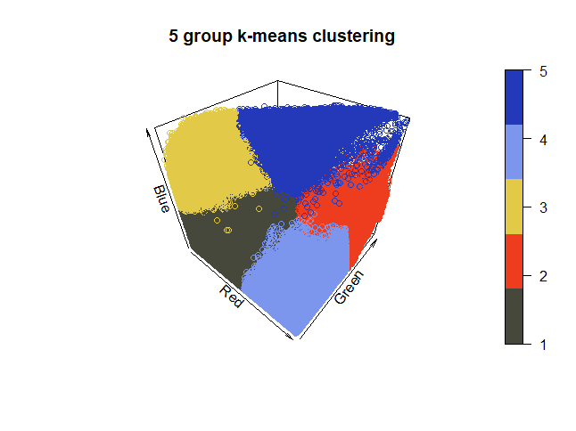 | 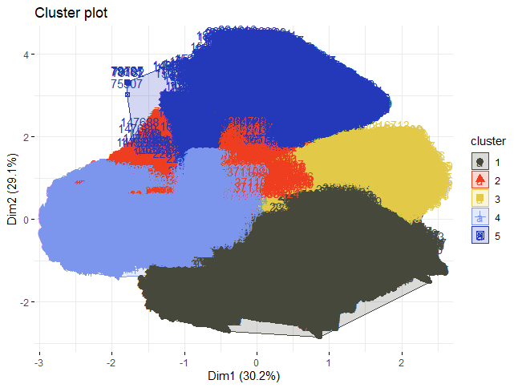

## Comparativos

Imagen en el espacio de colores original | Imagen en un espacio de 5 colores
:----------------------------------------|----------------------------------------:
 | 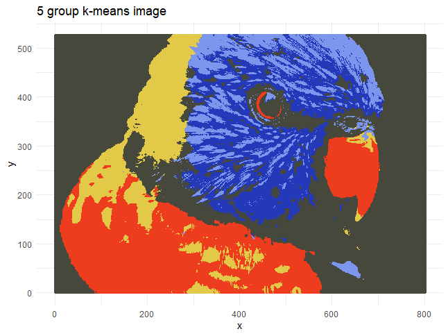

## Clustering k-means con 10 grupos

Clustering en el espacio RGB | Clustering en el espacio $PCA^2$
:----------------------------|----------------------------:
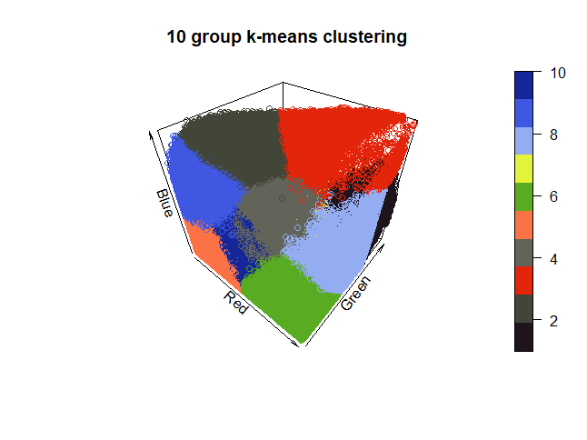 | 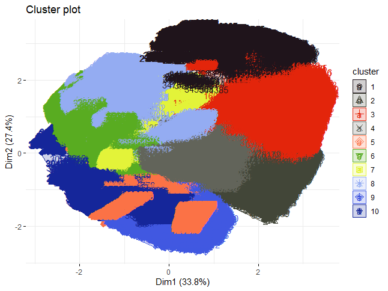

## Comparativos

Imagen en el espacio de colores original | Imagen en un espacio de 10 colores
:----------------------------------------|----------------------------------------:
 | 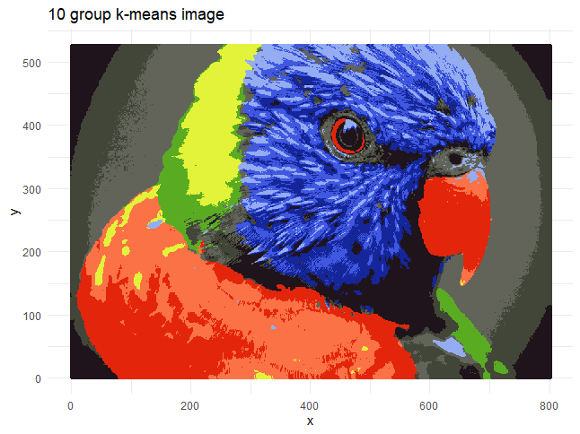

## Características de las clusterizaciones

|           Métrica           |   n = 3   |   n = 4   |   n = 5   |   n = 10  |
|:---------------------------:|:---------:|:---------:|:---------:|:---------:|
|     Total sum of squares    |  108,971  |  108,971  |  108,971  |  108,971  |
| Total within sum of squares | 39,999.45 | 30,435.43 |  27,286.2 | 12,324.78 |
|    Between sum of square    | 68,971.52 | 78,535.54 | 81,684.77 | 96,646.19 |
|       Between / Total       |    0.63   |    0.72   |    0.75   |    0.89   |

## Clustering espectral

```{r, echo=FALSE}
library(mlbench)
library(ggplot2)

obj <- mlbench.spirals(100,1,0.025)
my.data <-  as.data.frame(4 * obj$x)

ggplot(my.data)+
  geom_point(aes(V1, V2))+
  theme_minimal()+
  theme(axis.text = element_blank(),
        axis.title = element_blank())
```

## Primer intento

```{r, message=FALSE, warning=FALSE, eval=FALSE}
library(factoextra)

k <- kmeans(my.data, centers = 2)
fviz_cluster(k, my.data, geom = "point")+
  theme_minimal()+
  theme(axis.title = element_blank(),
        axis.text = element_blank())
```

## Primer intento

```{r, message=FALSE, warning=FALSE, echo=FALSE}
library(factoextra)

k <- kmeans(my.data, centers = 2)
fviz_cluster(k, my.data, geom = "point")+
  theme_minimal()+
  theme(axis.title = element_blank(),
        axis.text = element_blank())
```

## Segundo intento, (1er paso)

- Construir la matriz de similaridad usando un kernel gaussiano $$exp(-\alpha||x_i-x_j||^2)$$

```{r, echo=FALSE}
s <- function(x1, x2, alpha=1) {
  exp(- alpha * norm(as.matrix(x1-x2), type="F"))
}

make.similarity <- function(my.data, similarity) {
  N <- nrow(my.data)
  S <- matrix(rep(NA,N^2), ncol=N)
  for(i in 1:N) {
    for(j in 1:N) {
      S[i,j] <- similarity(my.data[i,], my.data[j,])
    }
  }
  S
}

S <- make.similarity(my.data, s)
S[1:8,1:8]
```


## 2° paso

- Proyectar los datos a un RKHS (reproducing kernel Hilbert space)

- $||f-g||<\delta \rightarrow |f(x)-g(x)|<\epsilon$

## 2° paso

```{r, echo=FALSE}
make.affinity <- function(S, n.neighboors=2) {
  N <- length(S[,1])

  if (n.neighboors >= N) {  # fully connected
    A <- S
  } else {
    A <- matrix(rep(0,N^2), ncol=N)
    for(i in 1:N) { # for each line
      # only connect to those points with larger similarity 
      best.similarities <- sort(S[i,], decreasing=TRUE)[1:n.neighboors]
      for (s in best.similarities) {
        j <- which(S[i,] == s)
        A[i,j] <- S[i,j]
        A[j,i] <- S[i,j] # to make an undirected graph, ie, the matrix becomes symmetric
      }
    }
  }
  A  
}

A <- make.affinity(S, 3)  # use 3 neighboors (includes self)

D <- diag(apply(A, 1, sum))

U <- D - A

"%^%" <- function(M, power)with(eigen(M), vectors %*% (values^power * solve(vectors)))

k   <- 2
evL <- eigen(U, symmetric=TRUE)
Z   <- as.data.frame(evL$vectors[,(ncol(evL$vectors)-k+1):ncol(evL$vectors)])

ggplot(Z)+
    geom_point(aes(V1, V2), 
    position = position_jitter(width = 0.001, height = 0.001), 
    alpha = 0.2, colour = "#242F34")+
  theme_minimal()+
  theme(axis.title = element_blank(),
        axis.text = element_blank())+
  ggtitle("Proyección en RKHS")
```

## 3er paso

- Clusterizamos en la proyección

```{r eval=FALSE}
km <- kmeans(Z, centers=2, nstart=5)
fviz_cluster(km, my.data, geom = "point")+
  theme_minimal()+
  theme(axis.text = element_blank(),
        axis.title = element_blank())
```

## 3er paso

```{r echo=FALSE}
km <- kmeans(Z, centers=2, nstart=5)
fviz_cluster(km, my.data, geom = "point")+
  theme_minimal()+
  theme(axis.text = element_blank(),
        axis.title = element_blank())
```

## Clustering jerárquico

## Ejemplo: Single Linkage

- Créditos: [Allison Horst](https://github.com/allisonhorst)

## {data-background="https://raw.githubusercontent.com/allisonhorst/stats-illustrations/master/other-stats-artwork/cluster_single_linkage_1.jpg"}

## {data-background="https://raw.githubusercontent.com/allisonhorst/stats-illustrations/master/other-stats-artwork/cluster_single_linkage_2.jpg"}

## {data-background="https://raw.githubusercontent.com/allisonhorst/stats-illustrations/master/other-stats-artwork/cluster_single_linkage_3.jpg"}

## {data-background="https://raw.githubusercontent.com/allisonhorst/stats-illustrations/master/other-stats-artwork/cluster_single_linkage_4.jpg"}

## {data-background="https://raw.githubusercontent.com/allisonhorst/stats-illustrations/master/other-stats-artwork/cluster_single_linkage_5.jpg"}

## {data-background="https://raw.githubusercontent.com/allisonhorst/stats-illustrations/master/other-stats-artwork/cluster_single_linkage_6.jpg"}

## {data-background="https://raw.githubusercontent.com/allisonhorst/stats-illustrations/master/other-stats-artwork/cluster_single_linkage_7.jpg"}


