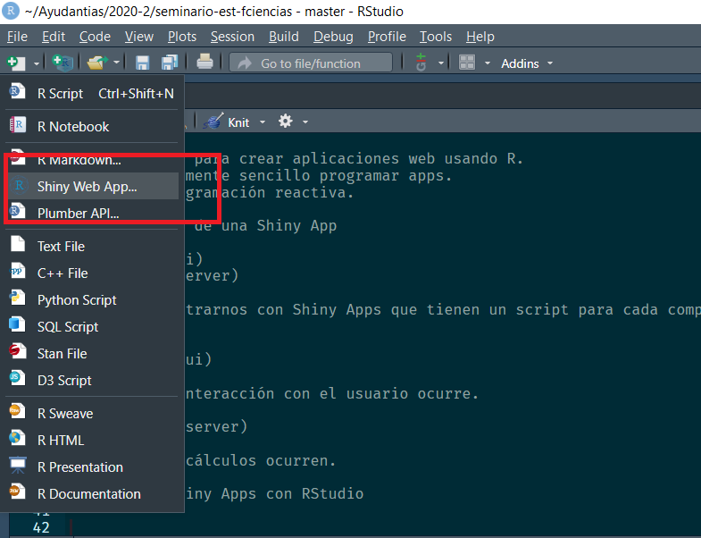
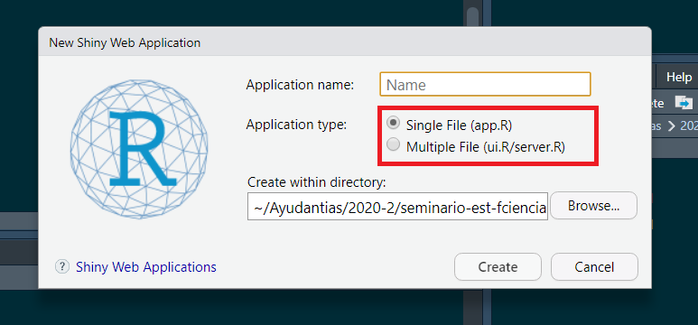
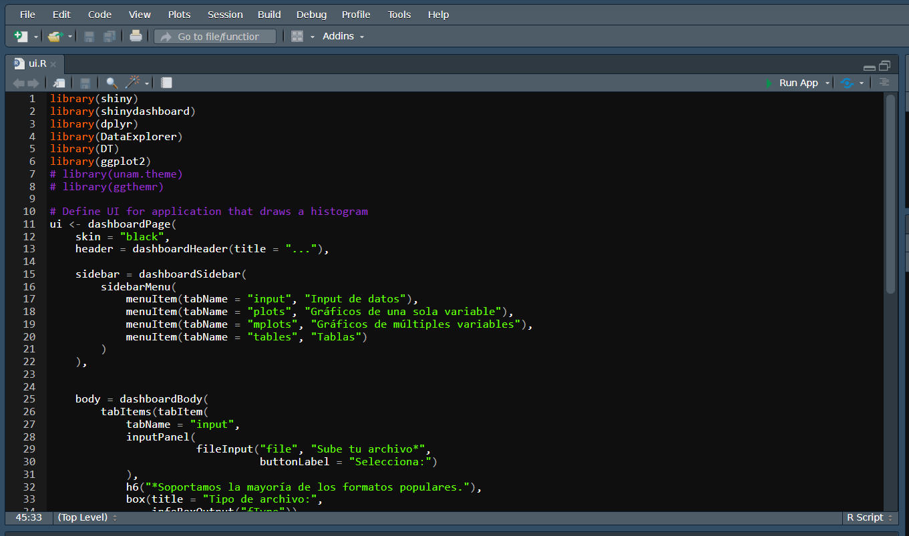
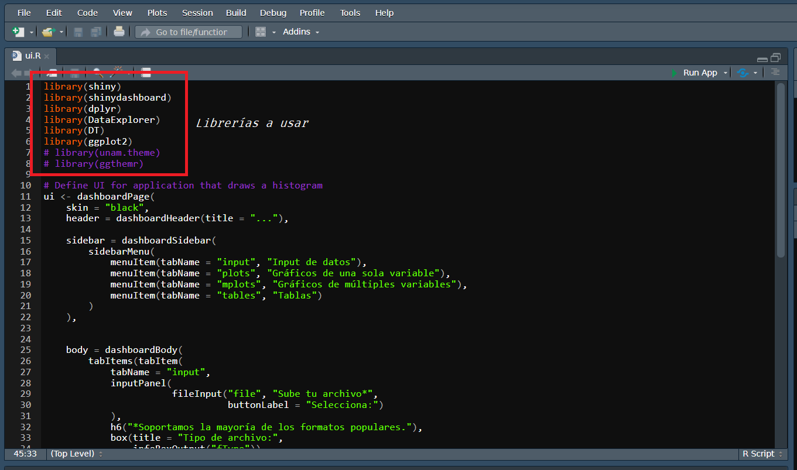
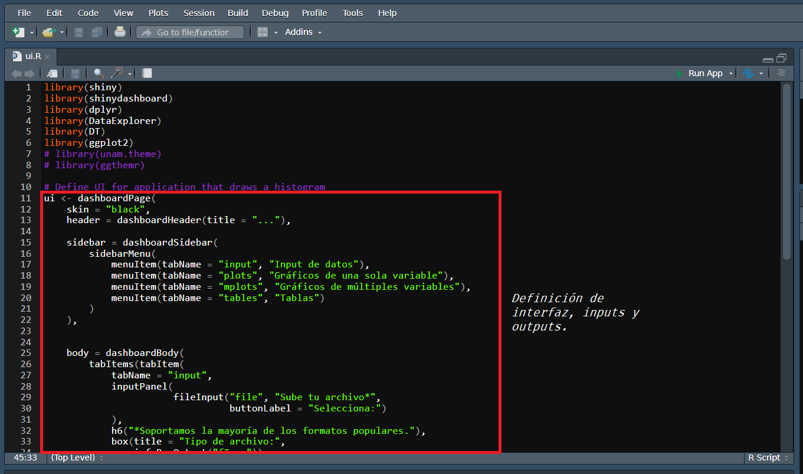
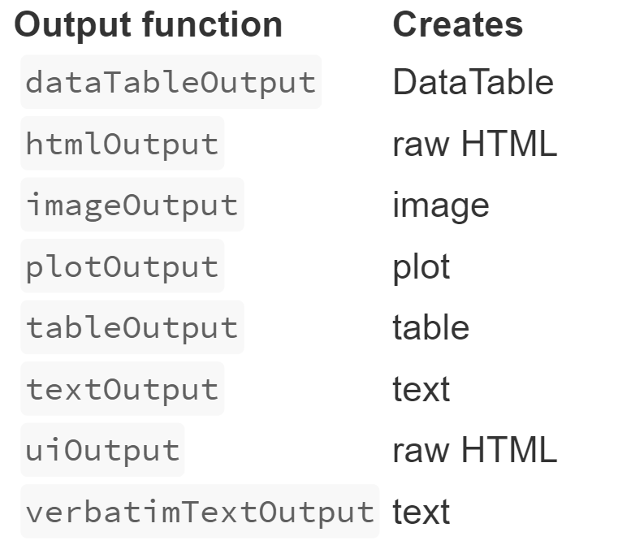
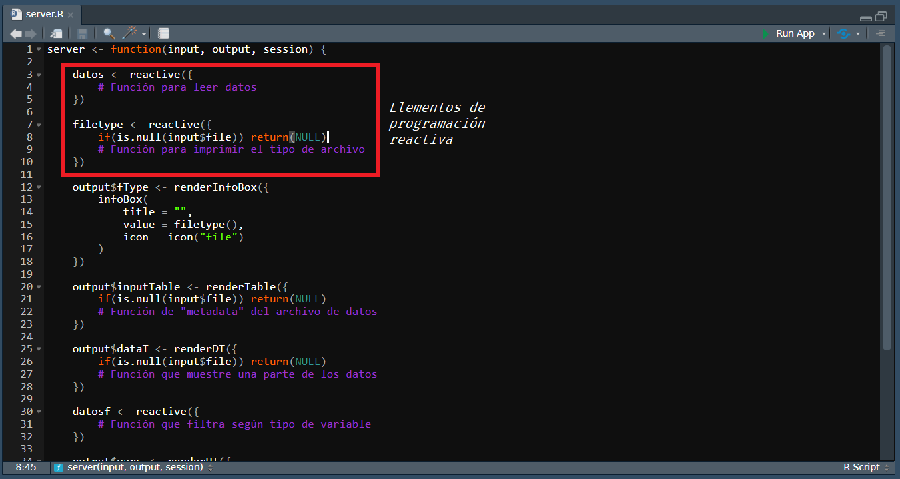
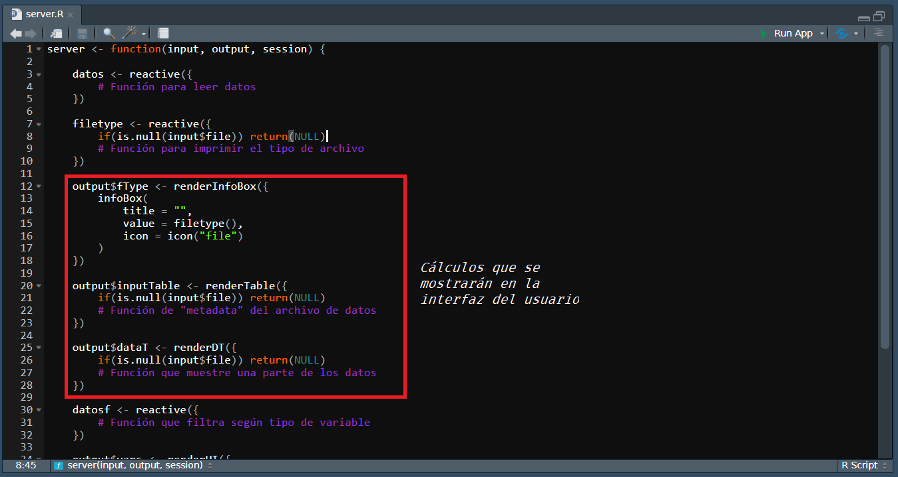

## ¿Cónocen Shiny?

## ¿Qué es Shiny? 

## {data-background-iframe="https://phillyo.shinyapps.io/intelligentsia/"}

## Algunas cosas sobre Shiny

- Es un marco para crear aplicaciones web usando R.
- Es relativamente sencillo programar apps.
- Utiliza programación reactiva.

## Componente de una Shiny App

- Interfaz (ui)
- Servidor (server)

Podemos encontrarnos con Shiny Apps que tienen un script para cada componente o bien un script para ambas cosas.

## Interfaz (ui)

Es donde la interacción con el usuario ocurre.

## Servidor (server) 

Es donde los cálculos ocurren.

## Creando Shiny Apps con RStudio|

## Creando Shiny Apps con RStudio

## UI

## UI

## UI

## Tipo de Inputs

## Tipo de Outpus

## Server

## Server

