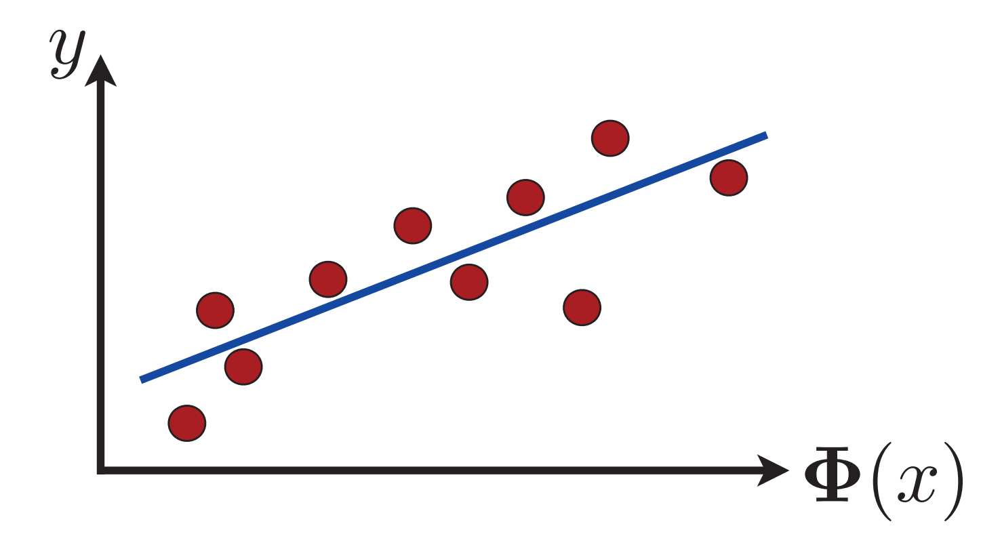
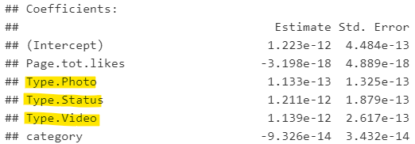

# __Un poco de notación__

- $x^{(i)}$: el conjunto de inputs (variables explicativas)
- $y^{(i)}$: es la variable de output/salida (variable dependiente) que queremos predecir (ajustar)
- A la pareja $(x^{(i)},y^{(i)})$ le llamaremos ejemplo de entrenamiento
- El conjunto de entrenamiento se denota por: $\{(x^{(i)},y^{(i)})|i\in N\}$
- De forma general, denotaremos por $\mathcal{X}$ al espacio de inputs y por $\mathcal{Y}$ al espacio de outputs
 
# __Entrenamiento de modelos__ {.justificado}

Dado un conjunto de entrenamiento $(x^{(i)},y^{(i)})\in(\mathcal{X} \times \mathcal{Y})$ el objetivo es "aprender" (ajustar) una función $h:\mathcal{X}\rightarrow \mathcal{Y}$ tal que $h(x)$ sea un "buen predictor" de $y$.

La función $h$ suele llamarse "hipótesis".

Cuando el conjunto $\mathcal{Y}$ es continuo, estamos frente a un problema de regresión. Si se trata de un conjunto discreto* entonces tenemos un problema de clasificación.

# __Regresión__

- Es uno de los modelos más populares en ciencia de datos.
- Tiene una amplia variedad de aplicaciones.
- La medida de error es la magnitud de la diferencia entre el valor real y el valor ajustado.

# __El algoritmo de regresión lineal__ {.justificado}

Sea $\Phi: \mathcal{X} \rightarrow \mathbb{R}^N$ y consideremos la familia de hipótesis lineales $$H=\{x\mapsto w \cdot \Phi(x)+b | w\in\mathbb{R}^N, b\in\mathbb{R}\}$$

La regresión lineal consiste en buscar la hipótesis $h\in H$ con el menor error cuadrático medio, es decir, se debe resolver el problema de optimización: $$\min \frac{1}{m}\sum_{i=1}^{m}(h(x_i)-y_i)^2$$

## __Regresión lineal "simple"__


*Cuando $N=1$ el problema consiste en encontrar la mejor linea que ajuste la nube de puntos. (1)*

## __¿Cómo resolvemos el problema?__

## __Algorítmo LMS (lo resolvemos sin resolverlo)__ {.justificado}

Permítasenos escribir las hipótesis lineales como $h(x)=\textbf{w}^Tx$

Queremos encontrar $\textbf{w}$ tal que minimice $\frac{1}{m}\sum_{i=1}^{m}(h(x_i)-y_i)^2$...(*)

## __Algorítmo LMS__ {.justificado}

El algoritmo empieza adivinando un valor inicial de $\textbf{w}$ que se va actualizando con el objetivo de minimizar (*)

¿Cómo?

$$w_j:=w_j-\alpha\frac{\partial}{\partial w_j}(*)$$

Es decir: $$w_j:=w_j-\alpha(h(x)-y)x_j$$

## __Ecuaciones normales (ahora sí lo resolvemos)__ {.justificado}

En lenguaje matricial nuestro problema de optimización puede escribirse como 
$$min\ F(W) = \frac{1}{m}\|X^TW-Y\|^2$$
$F$ es convexa y diferenciable por lo que tiene mínimo global sii $\nabla F(W)=0\ $ i.e.
$$\frac{2}{m}X(X^TW-Y)=0 \Leftrightarrow XX^TW=XY$$

## __Nuestro enfoque favorito__ {.justificado}

Supongamos que la variable ojetivo y las variables explicativas siguen: $$y^{(i)}=\theta^Tx^{(i)}+\epsilon^{(i)}$$

Supongamos que $\epsilon^{(i)}\sim_{iid}N(0,\sigma^2)$ entonces
$$f(y|x;w)=\frac{1}{\sqrt{2\pi}\sigma}exp(-\frac{(wx-y)^2}{2\sigma^2})$$

Dado X la distribución de y es: $$L(w)=\prod f(y|x:w)$$

## __Nuestro enfoque favorito__ {.justificado}

Para escoger $w$ tenemos que hacer que los datos sean tan probables como sea posible, i.e. hay que maximizar $L(w)$ o bien minimizar 
$$\ell(w) = mlog\frac{1}{\sqrt{2\pi}\sigma}-\frac{1}{\sigma^2}\cdot \frac{1}{2}\sum (wt-y)^2$$

## __Supuestos del modelo de regresión__

- El modelo es lineal (en los parámetros).

<details>
$\alpha+\beta_1x_1+\beta_2x_2^2$
</details>

- La media de los residuales es cero.

<details>
`mean(lm$residuals)`
</details>

- Homoscedasticidad de los residuales.

<details>
`plot(lm)`
</details>

- Los residuales no están autocorrelacionados.

<details>
`acf(lm)`
`lmtest::dwtest(lm)`
</details>

- Las variables independientes y los residuales tienen correlación cero.

<details>
`cor.test(df[,vars], lm$residuals)`
</details>

## __Supuestos del modelo de regresión__

- Los datos deben tener formato _long_

- La varianza de las variables independientes es positiva.

- No multicolinealidad entre las variables independientes

<details>
`car::vif(lm)`
</details>

- Los residuales tienen distribución normal

<details>
`plot(lm)`
</details>

## __Regresiones en R__

```{r, message=FALSE}
require(dplyr)
require(caret)

datos <- read.csv(paste0(here::here(),"/datos/uci-forest-fires/uci-forest-fires/forestfires.csv"))

datos <- datos %>% select(-X, -Y, -month, -day)

modelo <- lm(area~., datos) # usando el paquete stats
```

## __Podemos imprimir la información del modelo__

```{r}
modelo
```

## __Podemos obtener información más detallada__

```{r}
summary(modelo)
```

## __Validando supuestos__

```{r, echo=FALSE, animation.hook='gifski'}
for(i in 1:4){
  plot(modelo, which = i)
}
```


# __Regresión logística__

# __Modelos lineales generalizados__

# __Consideraciones (y reflexiones) sobre los modelos de "regresión"__

## __Espacios de inputs dicotómicos__

Es muy común encontrarnos con variables de "entrada" (explicativas) cuyo espacio de valores es dicotómico e.g. género, usar este tipo de variables en un modelo de regresión es bastante sencillo.

La transformación más recurrida suele ser $\mathbb{I}_{\{0,1\}}$

¿Qué implicaciones teóricas e interpretativas tiene?

## __La transformación $\mathbb{I}_{\{0,1\}}$__ {.justificado}

Supongamos un modelo lineal con una sola variable en el espacio $\mathcal{X}$, para fines prácticos pensemos que esa variable es _género_.

La transformación en cuestión nos dará el modelo siguiente:

$$y_i = \beta_0+\beta_1x_i+e_i = \begin{array}{lr} \beta_0+\beta_1+e_i & x = m\\ \beta_0+e_i & x\neq m\end{array}$$
De tal forma que $\beta_0$ representará el valor _promedio_ para hombres, $\beta_0 + \beta_1$ el valor _promedio_ para mujeres y $\beta_1$ la diferencia _promedio_ entre hombre y mujeres.

## __Otra transformación útil__ {.justificado}

La decisión de usar la transformación anterior con $\{1=m,\  0\neq m\}$ es, en realidad, arbitraria y no tiene efecto alguno en la regresión pero sí en la interpretación.

Si en lugar de usar la transformación $\mathbb{I}_{\{0,1\}}$, usamos: $\{1=m, \ -1\neq m\}$, tendríamos el siguiente modelo:

$$y_i = \beta_0+\beta_1x_i+e_i = \begin{array}{lr} \beta_0+\beta_1+e_i & x = m\\ \beta_0-\beta_1+e_i & x\neq m\end{array}$$
De esta forma $\beta_0$ sería el valor _base_ y $\beta_1$ la cantidad por la que las mujeres están por arriba (y los hombres por debajo) del valor base.

 <font size="5">¿Cómo sería $\beta_1$ en este caso, respecto al valor que tomaría en la transformación $\mathbb{I}_{\{0,1\}}$? </font>

## __Espacios de inputs categóricos__

¿Qué ocurre cuando alguna variable del espacio $\mathcal{X}$ tiene n-categorias ($n>2$)?

Por ejemplo en los datos del Facebook tenemos la variable _Type_ que nos indica el tipo del post:

```{r, echo=FALSE}
fb <- read.csv("C:/Users/David Alberto MMO/Documents/Ayudantias/2020-2/seminario-est-fciencias/datos/uci-facebook-metrics/uci-facebook-metrics/dataset_Facebook.csv", sep = ";")

table(fb$Type)
```

Sin embargo al hacer el modelo de regresión con esta variable, éste no contempla una categoría (¿o sí?): 



## __Sobre el supuesto aditivo__

Recordemos que el supuesto aditivo implica que el efecto en $Y$ bajo cambios en $X_j$ es independiente del valor de $X_i,\  \forall \ i\neq j$. Este supuesto es muy restrictivo y en la práctica no se suele cumplir.

Una forma de _relajar_ este supuesto es permitir la presencia de _interacciones_ como una variable de _input_, con lo cual pasaríamos de:

$$Y = \beta_0+\beta_1X_1+\beta_2X_2+e$$
al modelo:

$$Y = \beta_0+\beta_1X_1+\beta_2X_2+\beta_3X_1X_2+e$$

## __Sobre el supuesto aditivo__

¿Y eso no sigue siendo aditivo? Pues sí y no...

$$Y = \beta_0+\beta_1X_1+\beta_2X_2+\beta_3X_1X_2+e$$

$$Y = \beta_0+(\beta_1+\beta_3X_2)X_1+\beta_2X_2+e$$

$$Y = \beta_0+\hat{\beta_1}X_1+\beta_2X_2+e$$
En un modelo con interacciones (como este) los cambios en $X_2$ modificarán el efecto de $X_1$ en $Y$

# __Selección de modelos__


